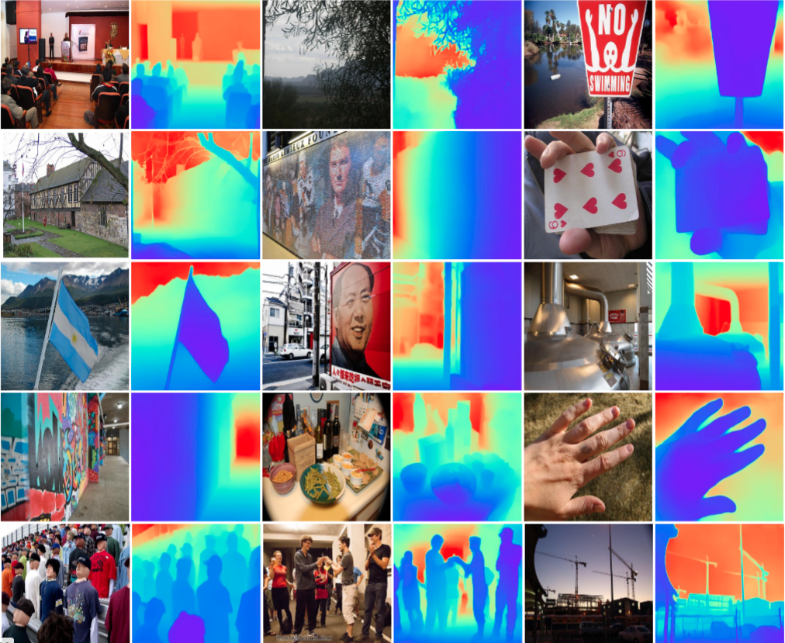

# AdelaiDepth
[](https://colab.research.google.com/drive/1rDLZBtiUgsFJrrL-xOgTVWxj6PMK9swq?usp=sharing)

AdelaiDepth is an open source toolbox for monocular depth prediction. Relevant work from our group is open-sourced here.

AdelaiDepth contains the following algorithms:
* 3D Scene Shape (Best Paper Finalist): [Code](https://github.com/aim-uofa/AdelaiDepth/tree/main/LeReS), [Learning to Recover 3D Scene Shape from a Single Image](https://arxiv.org/abs/2012.09365)
* DiverseDepth: [Code](https://github.com/YvanYin/DiverseDepth), [DiverseDepth: Affine-invariant Depth Prediction Using Diverse Data](https://arxiv.org/abs/2002.00569)
* Virtual Normal: [Code](https://github.com/YvanYin/VNL_Monocular_Depth_Prediction),  [Enforcing geometric constraints of virtual normal for depth prediction](https://arxiv.org/abs/1907.12209)
* Depth Estimation Using Deep Convolutional Neural Fields: [Code](https://bitbucket.org/fayao/dcnf-fcsp/src/master/), [Learning Depth from Single Monocular Images Using Deep Convolutional Neural Fields, TPAMI'16, CVPR'15](https://arxiv.org/abs/1502.07411)

## News:
* [Feb. 13, 2022] Training code and data of DiverseDepth have been released.
* [Jun. 13, 2021] Our "Learning to Recover 3D Scene Shape from a Single Image" work is one of the CVPR'21 Best Paper Finalists.
* [Jun. 6, 2021] We have made the training data of DiverseDepth available.

## Results and Dataset Examples:
1. 3D Scene Shape
  
 You may want to check [this video](http://www.youtube.com/watch?v=UuT5_GK_TWk) which provides a very brief introduction to the work:

<table>
  <tr>
    <td>RGB</td>
     <td>Depth</td>
     <td>Point Cloud</td>
  </tr>
  <tr>
    <td></td>  
    <td></td>
    <td></td>
  </tr>
 </table>




2. DiverseDepth

* Results examples：


* DiverseDepth dataset examples：


## BibTeX

```BibTeX
@inproceedings{Yin2019enforcing,
  title     = {Enforcing geometric constraints of virtual normal for depth prediction},
  author    = {Yin, Wei and Liu, Yifan and Shen, Chunhua and Yan, Youliang},
  booktitle = {The IEEE International Conference on Computer Vision (ICCV)},
  year      = {2019}
}

@inproceedings{Wei2021CVPR,
  title     =  {Learning to Recover 3D Scene Shape from a Single Image},
  author    =  {Wei Yin and Jianming Zhang and Oliver Wang and Simon Niklaus and Long Mai and Simon Chen and Chunhua Shen},
  booktitle =  {Proc. IEEE Conf. Comp. Vis. Patt. Recogn. (CVPR)},
  year      =  {2021}
}

@article{yin2021virtual,
  title   = {Virtual Normal: Enforcing Geometric Constraints for Accurate and Robust Depth Prediction},
  author  = {Yin, Wei and Liu, Yifan and Shen, Chunhua},
  journal = {IEEE Transactions on Pattern Analysis and Machine Intelligence (TPAMI)},
  year    = {2021}
}
```

### Contact
* Wei Yin <https://yvanyin.net/> 
* Chunhua Shen <https://cshen.github.io>

## License

The *3D Scene Shape* code is under a non-commercial license from *Adobe Research*. See the [LICENSE file](LeReS/LICENSE) for details.

Other depth prediction projects are licensed under the 2-clause BSD License for non-commercial use -- see the [LICENSE file](LICENSE) for details. For commercial use, please contact [Chunhua Shen](https://cshen.github.io).
